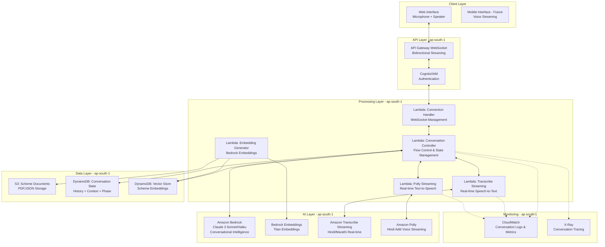
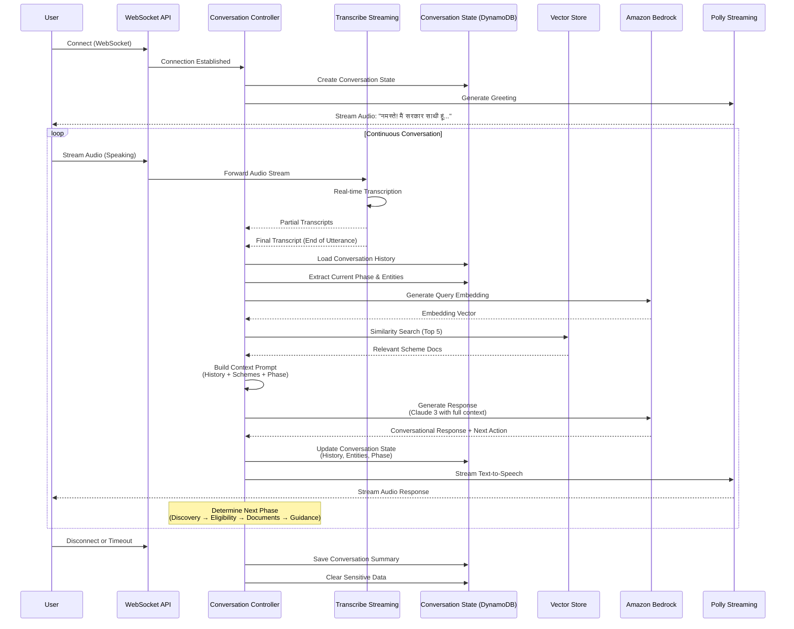

# Design Document: Sarkaar Saathi

## Overview

Sarkaar Saathi is a serverless, voice-first conversational companion built entirely on AWS-native services. The system uses Amazon Bedrock as its conversational reasoning engine, implementing a Retrieval-Augmented Generation (RAG) architecture to provide intelligent, context-aware guidance through natural multi-turn conversations.

### Core Innovation: Conversational RAG Architecture

Unlike traditional request-response chatbots, Sarkaar Saathi implements a continuous conversational system that:

1. **Maintains conversation state** across multiple turns with full context awareness
2. **Controls conversation flow** intelligently through phases: greeting → discovery → eligibility → documents → guidance
3. **Streams voice bidirectionally** using WebSocket for natural, responsive interactions
4. **Dynamically retrieves** relevant scheme information based on conversation context
5. **Generates contextual responses** using Bedrock with full conversation history
6. **Asks one question at a time** to avoid overwhelming citizens
7. **Adapts automatically** to scheme updates without code changes
8. **Provides personalized guidance** progressively based on conversation phase

This approach enables the system to handle the complexity of 50+ government schemes while providing human-like conversational experiences that guide citizens naturally from discovery to application readiness.

### Why Conversational vs Chatbot

**Traditional Chatbot Limitations:**
- Request-response pattern breaks conversation flow
- No conversation state management
- Cannot guide users through multi-step processes
- Requires users to know what to ask
- Static, pre-defined responses

**Conversational System Advantages:**
- Continuous bidirectional streaming
- Full conversation context and history
- Intelligent flow control and phase transitions
- Proactive guidance and follow-up questions
- Dynamic, context-aware responses
- Natural interruption handling

### Why Bedrock Over Other Solutions

**Amazon Bedrock provides:**
- Managed foundation models (Claude 3, Titan) without infrastructure overhead
- Superior conversational capabilities with long context windows (200K tokens for Claude 3)
- Built-in security and compliance features
- Pay-per-use pricing ideal for variable conversational workloads
- Low latency within AWS ecosystem for real-time conversations
- Support for both text generation and embeddings

### Target Users

- Rural citizens with limited literacy (primary) - voice-first removes barriers
- Urban citizens seeking scheme information (secondary)
- Government officials monitoring conversation analytics (tertiary)

### Success Metrics

- Conversation completion rate > 80% (citizen reaches guidance phase)
- Streaming latency < 500ms for transcription, < 2s for response generation
- Transcription accuracy > 85% for Hindi/Marathi
- Scheme recommendation relevance > 80% (user feedback)
- Average conversation turns to resolution < 10
- Cost per conversation < ₹5
- System availability > 99.5%


## Architecture

### High-Level Architecture



### Conversational Flow




## Components and Interfaces

### 1. API Gateway WebSocket Layer

**Purpose:** Establish and maintain bidirectional streaming connections for voice conversations

**WebSocket Routes:**

```
$connect - Establish connection
- Authenticate client
- Create connection ID
- Initialize conversation state
- Return connection confirmation

$disconnect - Clean up connection
- Save conversation summary
- Clear sensitive data
- Close resources

$default - Handle messages
- Route audio streams to Transcribe
- Route text messages to Conversation Controller
- Handle heartbeat/ping messages

sendMessage - Send responses to client
- Stream audio chunks
- Send conversation state updates
- Send error messages
```

**Configuration:**
- Connection timeout: 30 minutes with heartbeat
- Max message size: 128 KB per chunk
- Concurrent connections: 10,000 (adjustable)
- Authentication: API Key + IAM (future: Cognito)

### 2. Connection Handler Lambda

**Purpose:** Manage WebSocket connections and route messages

**Function:** `sarkaar-saathi-connection-handler`

**Runtime:** Python 3.11

**Memory:** 256 MB

**Timeout:** 30 seconds

**Implementation:**

```python
import boto3
import json
from datetime import datetime

dynamodb = boto3.resource('dynamodb', region_name='ap-south-1')
conversation_table = dynamodb.Table('sarkaar-saathi-conversations')

def lambda_handler(event, context):
    """
    Handle WebSocket connection lifecycle
    """
    route_key = event['requestContext']['routeKey']
    connection_id = event['requestContext']['connectionId']
    
    if route_key == '$connect':
        return handle_connect(connection_id, event)
    elif route_key == '$disconnect':
        return handle_disconnect(connection_id)
    elif route_key == '$default':
        return handle_message(connection_id, event)
    
    return {'statusCode': 400, 'body': 'Unknown route'}

def handle_connect(connection_id, event):
    """Initialize conversation state"""
    # Extract language preference from query params
    language = event.get('queryStringParameters', {}).get('language', 'hi')
    
    # Create conversation state
    conversation_table.put_item(
        Item={
            'connection_id': connection_id,
            'conversation_id': f"conv_{connection_id}",
            'language': language,
            'phase': 'greeting',
            'history': [],
            'entities': {},
            'created_at': datetime.utcnow().isoformat(),
            'last_activity': datetime.utcnow().isoformat(),
            'ttl': int(time.time()) + 86400  # 24 hours
        }
    )
    
    # Send greeting
    send_greeting(connection_id, language)
    
    return {'statusCode': 200, 'body': 'Connected'}

def handle_disconnect(connection_id):
    """Clean up conversation"""
    # Load conversation
    response = conversation_table.get_item(Key={'connection_id': connection_id})
    conversation = response.get('Item', {})
    
    # Save summary (remove sensitive data)
    save_conversation_summary(conversation)
    
    # Delete active conversation
    conversation_table.delete_item(Key={'connection_id': connection_id})
    
    return {'statusCode': 200, 'body': 'Disconnected'}

def handle_message(connection_id, event):
    """Route messages to appropriate handlers"""
    body = json.loads(event.get('body', '{}'))
    message_type = body.get('type')
    
    if message_type == 'audio':
        # Forward to Transcribe streaming
        return handle_audio_stream(connection_id, body)
    elif message_type == 'text':
        # Forward to Conversation Controller
        return handle_text_input(connection_id, body)
    elif message_type == 'heartbeat':
        return {'statusCode': 200, 'body': 'pong'}
    
    return {'statusCode': 400, 'body': 'Unknown message type'}

def send_greeting(connection_id, language):
    """Send initial greeting"""
    greetings = {
        'hi': 'नमस्ते! मैं सरकार साथी हूं। मैं आपको सरकारी योजनाओं के बारे में जानकारी देने में मदद कर सकता हूं। आप मुझसे क्या जानना चाहते हैं?',
        'mr': 'नमस्कार! मी सरकार साथी आहे। मी तुम्हाला सरकारी योजनांबद्दल माहिती देण्यास मदत करू शकतो. तुम्हाला काय जाणून घ्यायचे आहे?',
        'en': 'Hello! I am Sarkaar Saathi. I can help you learn about government schemes. What would you like to know?'
    }
    
    greeting_text = greetings.get(language, greetings['hi'])
    
    # Generate audio and send
    audio_url = generate_audio(greeting_text, language)
    send_to_client(connection_id, {
        'type': 'response',
        'text': greeting_text,
        'audio_url': audio_url,
        'phase': 'greeting'
    })
```

**IAM Permissions:**
- dynamodb:GetItem, dynamodb:PutItem, dynamodb:DeleteItem
- execute-api:ManageConnections (to send messages to clients)


### 3. Conversation Controller Lambda (Core Orchestrator)

**Purpose:** Manage conversation flow, state, and orchestrate RAG pipeline

**Function:** `sarkaar-saathi-conversation-controller`

**Runtime:** Python 3.11

**Memory:** 1536 MB

**Timeout:** 60 seconds

**Implementation:**

```python
import boto3
import json
import numpy as np
from datetime import datetime
from enum import Enum

bedrock_runtime = boto3.client('bedrock-runtime', region_name='ap-south-1')
dynamodb = boto3.resource('dynamodb', region_name='ap-south-1')

conversation_table = dynamodb.Table('sarkaar-saathi-conversations')
vector_table = dynamodb.Table('sarkaar-saathi-vectors')

class ConversationPhase(Enum):
    GREETING = "greeting"
    DISCOVERY = "discovery"
    ELIGIBILITY = "eligibility"
    DOCUMENTS = "documents"
    GUIDANCE = "guidance"
    CLOSURE = "closure"

def lambda_handler(event, context):
    """
    Orchestrate conversation turn: transcription → RAG → response generation → TTS
    """
    connection_id = event['connection_id']
    user_input = event['user_input']  # From Transcribe
    
    # Step 1: Load conversation state
    conversation = load_conversation(connection_id)
    
    # Step 2: Generate query embedding
    query_embedding = generate_embedding(user_input)
    
    # Step 3: Retrieve relevant schemes (RAG)
    relevant_schemes = retrieve_schemes(query_embedding, top_k=5)
    
    # Step 4: Determine conversation phase and next action
    current_phase = ConversationPhase(conversation['phase'])
    next_action = determine_next_action(conversation, user_input, relevant_schemes)
    
    # Step 5: Build context-aware prompt
    prompt = build_conversational_prompt(
        conversation=conversation,
        user_input=user_input,
        schemes=relevant_schemes,
        phase=current_phase,
        next_action=next_action
    )
    
    # Step 6: Generate response using Bedrock
    response_data = generate_bedrock_response(prompt, conversation['language'])
    
    # Step 7: Extract entities and update conversation state
    updated_conversation = update_conversation_state(
        conversation=conversation,
        user_input=user_input,
        response=response_data['text'],
        entities=response_data.get('entities', {}),
        next_phase=response_data.get('next_phase', current_phase.value),
        schemes=relevant_schemes
    )
    
    # Step 8: Save conversation state
    save_conversation(updated_conversation)
    
    # Step 9: Generate audio response (async)
    audio_url = generate_audio_async(response_data['text'], conversation['language'])
    
    # Step 10: Send response to client via WebSocket
    send_to_client(connection_id, {
        'type': 'response',
        'text': response_data['text'],
        'audio_url': audio_url,
        'phase': response_data.get('next_phase'),
        'entities': response_data.get('entities', {}),
        'schemes': [s['scheme_id'] for s in relevant_schemes]
    })
    
    return {'statusCode': 200}

def determine_next_action(conversation, user_input, schemes):
    """
    Determine what the conversation should do next based on current state
    """
    phase = ConversationPhase(conversation['phase'])
    entities = conversation.get('entities', {})
    
    if phase == ConversationPhase.GREETING:
        # Move to discovery - understand what user needs
        return {
            'action': 'discover_need',
            'prompt_instruction': 'Ask what kind of help the citizen needs'
        }
    
    elif phase == ConversationPhase.DISCOVERY:
        # Check if we have enough info to suggest schemes
        if schemes and len(schemes) > 0:
            return {
                'action': 'suggest_schemes',
                'prompt_instruction': 'Introduce the most relevant scheme and ask if they want to know more'
            }
        else:
            return {
                'action': 'clarify_need',
                'prompt_instruction': 'Ask clarifying questions about their situation'
            }
    
    elif phase == ConversationPhase.ELIGIBILITY:
        # Progressively collect eligibility criteria
        missing_criteria = get_missing_eligibility_criteria(entities, schemes[0] if schemes else None)
        if missing_criteria:
            return {
                'action': 'collect_eligibility',
                'prompt_instruction': f'Ask about {missing_criteria[0]} in a natural way',
                'missing_criteria': missing_criteria
            }
        else:
            return {
                'action': 'determine_eligibility',
                'prompt_instruction': 'Determine if citizen is eligible and explain result'
            }
    
    elif phase == ConversationPhase.DOCUMENTS:
        # Guide through document requirements
        return {
            'action': 'explain_documents',
            'prompt_instruction': 'Explain required documents one at a time, ask if they have each one'
        }
    
    elif phase == ConversationPhase.GUIDANCE:
        # Provide application guidance
        return {
            'action': 'provide_guidance',
            'prompt_instruction': 'Explain how to apply, where to go, what to do next'
        }
    
    return {'action': 'continue', 'prompt_instruction': 'Continue the conversation naturally'}

def build_conversational_prompt(conversation, user_input, schemes, phase, next_action):
    """
    Build comprehensive prompt with conversation history and context
    """
    language_map = {
        'hi': 'Hindi',
        'mr': 'Marathi',
        'en': 'English'
    }
    
    language = language_map[conversation['language']]
    
    # Build conversation history (last 5 turns)
    history = conversation.get('history', [])[-5:]
    conversation_history = "\n".join([
        f"Citizen: {turn['user']}\nSarkaar Saathi: {turn['assistant']}"
        for turn in history
    ])
    
    # Build scheme context
    scheme_context = "\n\n".join([
        f"Scheme: {s['metadata']['name']}\n{s['content']}"
        for s in schemes[:3]  # Top 3 schemes
    ])
    
    # Build entities context
    entities = conversation.get('entities', {})
    entities_str = json.dumps(entities, indent=2) if entities else "None collected yet"
    
    prompt = f"""You are Sarkaar Saathi, a helpful voice-based government scheme assistant for Indian citizens. You are having a natural, flowing conversation.

CRITICAL INSTRUCTIONS:
1. Speak in {language} ONLY
2. Keep responses SHORT (2-3 sentences max) - this is a voice conversation
3. Ask ONE question at a time
4. Be warm, supportive, and conversational
5. Use simple language suitable for citizens with limited literacy
6. Current conversation phase: {phase.value}
7. Next action: {next_action['prompt_instruction']}

CONVERSATION HISTORY:
{conversation_history}

CURRENT CITIZEN INPUT:
{user_input}

COLLECTED INFORMATION ABOUT CITIZEN:
{entities_str}

RELEVANT GOVERNMENT SCHEMES:
{scheme_context}

RESPONSE GUIDELINES:
- If in DISCOVERY phase: Understand their need, ask clarifying questions
- If in ELIGIBILITY phase: Ask about ONE eligibility criterion at a time (age, income, location, occupation)
- If in DOCUMENTS phase: Explain ONE document at a time, ask if they have it
- If in GUIDANCE phase: Provide clear next steps for application
- Always acknowledge what they said before asking next question
- Naturally weave in fraud warnings when discussing fees or application process
- If they seem confused, simplify and provide examples

YOUR RESPONSE (in {language}, 2-3 sentences max):"""
    
    return prompt

def generate_bedrock_response(prompt, language):
    """
    Generate conversational response using Claude 3
    """
    # Use Haiku for speed in conversations
    model_id = 'anthropic.claude-3-haiku-20240307-v1:0'
    
    response = bedrock_runtime.invoke_model(
        modelId=model_id,
        body=json.dumps({
            'anthropic_version': 'bedrock-2023-05-31',
            'max_tokens': 512,  # Shorter for voice
            'temperature': 0.7,
            'messages': [
                {
                    'role': 'user',
                    'content': prompt
                }
            ]
        })
    )
    
    result = json.loads(response['body'].read())
    response_text = result['content'][0]['text']
    
    # Extract structured data from response (entities, next phase)
    # This would use a more sophisticated extraction in production
    return {
        'text': response_text,
        'entities': {},  # Extract from response
        'next_phase': determine_phase_transition(response_text)
    }

def update_conversation_state(conversation, user_input, response, entities, next_phase, schemes):
    """
    Update conversation state with new turn
    """
    # Add to history
    conversation['history'].append({
        'user': user_input,
        'assistant': response,
        'timestamp': datetime.utcnow().isoformat(),
        'schemes': [s['scheme_id'] for s in schemes]
    })
    
    # Update entities
    conversation['entities'].update(entities)
    
    # Update phase
    conversation['phase'] = next_phase
    
    # Update last activity
    conversation['last_activity'] = datetime.utcnow().isoformat()
    
    return conversation

def save_conversation(conversation):
    """Save conversation state to DynamoDB"""
    conversation_table.put_item(Item=conversation)
```

**IAM Permissions:**
- bedrock:InvokeModel
- dynamodb:GetItem, dynamodb:PutItem, dynamodb:UpdateItem, dynamodb:Scan
- execute-api:ManageConnections


### 4. Transcribe Streaming Lambda

**Purpose:** Real-time speech-to-text conversion using Amazon Transcribe Streaming

**Function:** `sarkaar-saathi-transcribe-streaming`

**Runtime:** Python 3.11

**Memory:** 512 MB

**Timeout:** 300 seconds (for long conversations)

**Implementation:**

```python
import boto3
import asyncio
from amazon_transcribe.client import TranscribeStreamingClient
from amazon_transcribe.handlers import TranscriptResultStreamHandler
from amazon_transcribe.model import TranscriptEvent

class ConversationTranscriptHandler(TranscriptResultStreamHandler):
    """Handle streaming transcription results"""
    
    def __init__(self, connection_id, output_stream):
        super().__init__(output_stream)
        self.connection_id = connection_id
        self.partial_transcript = ""
        self.final_transcript = ""
    
    async def handle_transcript_event(self, transcript_event: TranscriptEvent):
        """Process transcription events"""
        results = transcript_event.transcript.results
        
        for result in results:
            if not result.is_partial:
                # Final transcript - send to Conversation Controller
                for alt in result.alternatives:
                    self.final_transcript = alt.transcript
                    await self.process_final_transcript(self.final_transcript)
            else:
                # Partial transcript - can show to user for feedback
                for alt in result.alternatives:
                    self.partial_transcript = alt.transcript
                    await self.send_partial_transcript(self.partial_transcript)
    
    async def process_final_transcript(self, transcript):
        """Send final transcript to Conversation Controller"""
        # Invoke Conversation Controller
        lambda_client = boto3.client('lambda', region_name='ap-south-1')
        lambda_client.invoke(
            FunctionName='sarkaar-saathi-conversation-controller',
            InvocationType='Event',  # Async
            Payload=json.dumps({
                'connection_id': self.connection_id,
                'user_input': transcript
            })
        )
    
    async def send_partial_transcript(self, transcript):
        """Send partial transcript to client for real-time feedback"""
        send_to_client(self.connection_id, {
            'type': 'partial_transcript',
            'text': transcript
        })

async def transcribe_audio_stream(connection_id, audio_stream, language_code='hi-IN'):
    """
    Stream audio to Transcribe and handle results
    """
    client = TranscribeStreamingClient(region="ap-south-1")
    
    stream = await client.start_stream_transcription(
        language_code=language_code,
        media_sample_rate_hz=16000,
        media_encoding="pcm",
    )
    
    handler = ConversationTranscriptHandler(connection_id, stream.output_stream)
    
    await asyncio.gather(
        write_audio_chunks(stream.input_stream, audio_stream),
        handler.handle_events()
    )

async def write_audio_chunks(input_stream, audio_stream):
    """Write audio chunks to Transcribe input stream"""
    async for chunk in audio_stream:
        await input_stream.send_audio_event(audio_chunk=chunk)
    await input_stream.end_stream()

def lambda_handler(event, context):
    """
    Handle streaming transcription
    """
    connection_id = event['connection_id']
    audio_stream = event['audio_stream']
    language = event.get('language', 'hi')
    
    language_code_map = {
        'hi': 'hi-IN',
        'mr': 'mr-IN',
        'en': 'en-IN'
    }
    
    # Start async transcription
    asyncio.run(transcribe_audio_stream(
        connection_id,
        audio_stream,
        language_code_map[language]
    ))
    
    return {'statusCode': 200}
```

**IAM Permissions:**
- transcribe:StartStreamTranscription
- lambda:InvokeFunction
- execute-api:ManageConnections

### 5. Polly Streaming Lambda

**Purpose:** Real-time text-to-speech conversion using Amazon Polly

**Function:** `sarkaar-saathi-polly-streaming`

**Runtime:** Python 3.11

**Memory:** 512 MB

**Timeout:** 30 seconds

**Implementation:**

```python
import boto3
import json
import base64

polly = boto3.client('polly', region_name='ap-south-1')
apigateway = boto3.client('apigatewaymanagementapi')

def lambda_handler(event, context):
    """
    Stream text-to-speech audio to client
    """
    connection_id = event['connection_id']
    text = event['text']
    language = event.get('language', 'hi')
    
    # Select voice based on language
    voice_map = {
        'hi': 'Aditi',  # Hindi female voice
        'mr': 'Aditi',  # Use Hindi voice for Marathi (limited options)
        'en': 'Raveena'  # Indian English female voice
    }
    
    voice_id = voice_map.get(language, 'Aditi')
    
    # Start speech synthesis stream
    response = polly.synthesize_speech(
        Text=text,
        OutputFormat='mp3',
        VoiceId=voice_id,
        Engine='neural',  # Better quality
        LanguageCode=f'{language}-IN' if language != 'mr' else 'hi-IN'
    )
    
    # Stream audio chunks to client
    audio_stream = response['AudioStream']
    chunk_size = 4096  # 4KB chunks
    
    while True:
        chunk = audio_stream.read(chunk_size)
        if not chunk:
            break
        
        # Send chunk to client via WebSocket
        send_audio_chunk(connection_id, chunk)
    
    # Send end-of-audio marker
    send_to_client(connection_id, {
        'type': 'audio_complete'
    })
    
    return {'statusCode': 200}

def send_audio_chunk(connection_id, audio_chunk):
    """Send audio chunk to client via WebSocket"""
    # Get API Gateway endpoint from environment
    endpoint_url = os.environ['WEBSOCKET_API_ENDPOINT']
    
    apigateway = boto3.client(
        'apigatewaymanagementapi',
        endpoint_url=endpoint_url
    )
    
    # Encode audio as base64 for JSON transport
    audio_b64 = base64.b64encode(audio_chunk).decode('utf-8')
    
    apigateway.post_to_connection(
        ConnectionId=connection_id,
        Data=json.dumps({
            'type': 'audio_chunk',
            'data': audio_b64
        })
    )
```

**IAM Permissions:**
- polly:SynthesizeSpeech
- execute-api:ManageConnections

### 5. Embedding Generator Lambda

**Purpose:** Generate embeddings for scheme documents and store in vector database

**Function:** `sarkaar-saathi-embedding-generator`

**Runtime:** Python 3.11

**Memory:** 1024 MB

**Timeout:** 300 seconds (for batch processing)

**Trigger:** S3 Event (when new scheme documents uploaded)

**Implementation:**

```python
import boto3
import json
import uuid

bedrock_runtime = boto3.client('bedrock-runtime', region_name='ap-south-1')
dynamodb = boto3.resource('dynamodb', region_name='ap-south-1')
s3 = boto3.client('s3', region_name='ap-south-1')

vector_table = dynamodb.Table('sarkaar-saathi-vectors')

def lambda_handler(event, context):
    """
    Generate embeddings for uploaded scheme documents
    Triggered by S3 upload events
    """
    for record in event['Records']:
        bucket = record['s3']['bucket']['name']
        key = record['s3']['object']['key']
        
        # Download scheme document
        response = s3.get_object(Bucket=bucket, Key=key)
        content = response['Body'].read().decode('utf-8')
        
        # Parse scheme JSON
        scheme_data = json.loads(content)
        
        # Generate embeddings for scheme content
        process_scheme(scheme_data)
    
    return {'statusCode': 200, 'body': 'Embeddings generated'}

def process_scheme(scheme_data):
    """
    Process a single scheme and generate embeddings
    """
    scheme_id = scheme_data['id']
    
    # Create chunks for embedding (max 512 tokens per chunk)
    chunks = create_chunks(scheme_data)
    
    for idx, chunk in enumerate(chunks):
        # Generate embedding
        embedding = generate_embedding(chunk['text'])
        
        # Store in DynamoDB
        vector_table.put_item(
            Item={
                'vector_id': f"{scheme_id}_{idx}",
                'scheme_id': scheme_id,
                'embedding': embedding,
                'content': chunk['text'],
                'metadata': {
                    'name': scheme_data['name'],
                    'category': scheme_data['category'],
                    'eligibility': scheme_data.get('eligibility', {}),
                    'benefits': scheme_data.get('benefits', ''),
                    'chunk_index': idx
                }
            }
        )

def create_chunks(scheme_data):
    """
    Split scheme data into chunks for embedding
    """
    chunks = []
    
    # Chunk 1: Overview
    overview_text = f"""
    Scheme Name: {scheme_data['name']}
    Category: {scheme_data['category']}
    Description: {scheme_data['description']}
    """
    chunks.append({'text': overview_text, 'type': 'overview'})
    
    # Chunk 2: Eligibility
    if 'eligibility' in scheme_data:
        eligibility_text = f"""
        Eligibility Criteria for {scheme_data['name']}:
        {json.dumps(scheme_data['eligibility'], indent=2)}
        """
        chunks.append({'text': eligibility_text, 'type': 'eligibility'})
    
    # Chunk 3: Benefits
    if 'benefits' in scheme_data:
        benefits_text = f"""
        Benefits of {scheme_data['name']}:
        {scheme_data['benefits']}
        """
        chunks.append({'text': benefits_text, 'type': 'benefits'})
    
    # Chunk 4: Application Process
    if 'application_process' in scheme_data:
        process_text = f"""
        How to Apply for {scheme_data['name']}:
        {scheme_data['application_process']}
        Required Documents: {', '.join(scheme_data.get('required_documents', []))}
        """
        chunks.append({'text': process_text, 'type': 'application'})
    
    return chunks

def generate_embedding(text):
    """Generate embedding using Bedrock Titan"""
    response = bedrock_runtime.invoke_model(
        modelId='amazon.titan-embed-text-v1',
        body=json.dumps({'inputText': text})
    )
    result = json.loads(response['body'].read())
    return result['embedding']
```

**IAM Permissions:**
- bedrock:InvokeModel
- dynamodb:PutItem
- s3:GetObject


## Data Models

### 1. Scheme Document (S3 + DynamoDB)

**S3 Storage:** `s3://sarkaar-saathi-schemes/schemes/{scheme_id}.json`

**Schema:**

```json
{
  "id": "mh-agri-001",
  "name": "Mahatma Jyotiba Phule Shetkari Karjmukti Yojana",
  "name_hi": "महात्मा ज्योतिबा फुले शेतकरी कर्जमुक्ती योजना",
  "name_mr": "महात्मा ज्योतिबा फुले शेतकरी कर्जमुक्ती योजना",
  "category": "agriculture",
  "state": "Maharashtra",
  "description": "Loan waiver scheme for farmers with outstanding crop loans",
  "description_hi": "बकाया फसल ऋण वाले किसानों के लिए ऋण माफी योजना",
  "description_mr": "थकबाकी पीक कर्ज असलेल्या शेतकऱ्यांसाठी कर्जमाफी योजना",
  "eligibility": {
    "occupation": ["farmer", "agricultural_worker"],
    "land_holding": "< 5 acres",
    "loan_amount": "< 150000",
    "state": "Maharashtra",
    "loan_date": "before 2015-03-31"
  },
  "benefits": "Complete waiver of crop loans up to ₹1.5 lakh",
  "benefits_hi": "₹1.5 लाख तक के फसल ऋण की पूर्ण माफी",
  "benefits_mr": "₹1.5 लाखापर्यंत पीक कर्जाची संपूर्ण माफी",
  "required_documents": [
    "Aadhaar Card",
    "7/12 Extract (Land Records)",
    "Loan Passbook",
    "Bank Account Details",
    "Income Certificate"
  ],
  "application_process": "Visit nearest agriculture office or apply online at mahadbt.gov.in",
  "application_process_hi": "निकटतम कृषि कार्यालय में जाएं या mahadbt.gov.in पर ऑनलाइन आवेदन करें",
  "application_process_mr": "जवळच्या कृषी कार्यालयात भेट द्या किंवा mahadbt.gov.in वर ऑनलाइन अर्ज करा",
  "official_website": "https://mahadbt.gov.in",
  "helpline": "1800-123-4567",
  "last_updated": "2024-01-15",
  "status": "active"
}
```

### 2. Vector Embedding (DynamoDB)

**Table:** `sarkaar-saathi-vectors`

**Primary Key:** `vector_id` (String)

**Schema:**

```json
{
  "vector_id": "mh-agri-001_0",
  "scheme_id": "mh-agri-001",
  "embedding": [0.123, -0.456, 0.789, ...],  // 1536 dimensions for Titan
  "content": "Scheme Name: Mahatma Jyotiba Phule Shetkari Karjmukti Yojana...",
  "metadata": {
    "name": "Mahatma Jyotiba Phule Shetkari Karjmukti Yojana",
    "category": "agriculture",
    "state": "Maharashtra",
    "eligibility": {
      "occupation": ["farmer"],
      "land_holding": "< 5 acres"
    },
    "chunk_index": 0,
    "chunk_type": "overview"
  },
  "created_at": "2024-01-15T10:30:00Z"
}
```

**Indexes:**
- GSI: `scheme_id-index` (for retrieving all chunks of a scheme)

### 3. Conversation State (DynamoDB)

**Table:** `sarkaar-saathi-conversations`

**Primary Key:** `connection_id` (String)

**TTL:** `ttl` (Number) - Auto-delete after 24 hours

**Schema:**

```json
{
  "connection_id": "abc123xyz",
  "conversation_id": "conv_abc123xyz",
  "language": "hi",
  "phase": "eligibility",
  "entities": {
    "occupation": "farmer",
    "location": "Pune",
    "age": 45,
    "income_range": "< 200000",
    "land_holding": "3 acres"
  },
  "history": [
    {
      "user": "मुझे खेती के लिए कर्ज माफी योजना चाहिए",
      "assistant": "बहुत अच्छा! मैं आपकी मदद कर सकता हूं। क्या आप मुझे बता सकते हैं कि आपके पास कितनी जमीन है?",
      "timestamp": "2024-01-15T10:30:00Z",
      "schemes": ["mh-agri-001"],
      "phase": "discovery"
    },
    {
      "user": "मेरे पास 3 एकड़ जमीन है",
      "assistant": "समझ गया। और आपका कर्ज कितना है?",
      "timestamp": "2024-01-15T10:31:00Z",
      "schemes": ["mh-agri-001"],
      "phase": "eligibility"
    }
  ],
  "current_schemes": ["mh-agri-001"],
  "created_at": "2024-01-15T10:30:00Z",
  "last_activity": "2024-01-15T10:35:00Z",
  "ttl": 1705411200
}
```

**Indexes:**
- GSI: `conversation_id-index` (for analytics and resumption)

### 4. Scheme Metadata (DynamoDB)

**Table:** `sarkaar-saathi-scheme-metadata`

**Primary Key:** `scheme_id` (String)

**Schema:**

```json
{
  "scheme_id": "mh-agri-001",
  "name": "Mahatma Jyotiba Phule Shetkari Karjmukti Yojana",
  "category": "agriculture",
  "state": "Maharashtra",
  "status": "active",
  "s3_key": "schemes/mh-agri-001.json",
  "embedding_count": 4,
  "last_updated": "2024-01-15T10:30:00Z",
  "view_count": 1523,
  "application_count": 342
}
```

**Indexes:**
- GSI: `category-index` (for category-based filtering)
- GSI: `state-index` (for state-based filtering)


## Correctness Properties

A property is a characteristic or behavior that should hold true across all valid executions of a system - essentially, a formal statement about what the system should do. Properties serve as the bridge between human-readable specifications and machine-verifiable correctness guarantees.

### Property 1: RAG Retrieval Returns Results

*For any* valid citizen query, the RAG_Engine should retrieve at least one scheme document (or return an explicit "no results" response if similarity scores are below threshold).

**Validates: Requirements 2.1, 3.1**

### Property 2: Scheme Ranking by Relevance

*For any* query that retrieves multiple schemes, the results should be ordered by descending similarity score, ensuring the most relevant scheme appears first.

**Validates: Requirements 2.4, 5.3**

### Property 3: Retrieved Context Appears in Prompt

*For any* query where schemes are retrieved, those scheme documents should appear in the context section of the prompt sent to Bedrock_Service.

**Validates: Requirements 3.2**

### Property 4: Response Citations Match Retrieved Schemes

*For any* Bedrock response that references schemes, the cited scheme IDs should be a subset of the schemes retrieved by the RAG_Engine.

**Validates: Requirements 3.3**

### Property 5: Scheme Explanation Completeness

*For any* scheme explanation response, the text should contain references to eligibility criteria, benefits, and application process (or explicitly state if information is unavailable).

**Validates: Requirements 4.2**

### Property 6: Eligibility Follow-up Questions Generated

*For any* query expressing interest in a scheme category, the system should generate at least one follow-up question about age, income, location, or occupation.

**Validates: Requirements 5.1**

### Property 7: Eligibility Matching Produces Boolean Result

*For any* citizen profile and scheme eligibility criteria, the matching function should return a clear boolean result (eligible/not eligible) with reasoning.

**Validates: Requirements 5.2**

### Property 8: Document Checklist Matches Scheme Data

*For any* scheme, the generated document checklist should exactly match the scheme's required_documents field from the scheme repository.

**Validates: Requirements 6.1**

### Property 9: Document Explanations Completeness

*For any* document in a generated checklist, there should be an accompanying explanation of its purpose.

**Validates: Requirements 6.2**

### Property 10: Fraud Warnings in Fee Queries

*For any* query containing keywords related to fees or payments, the response should include a fraud warning stating that government schemes are free.

**Validates: Requirements 7.1, 7.2**

### Property 11: Language Consistency

*For any* session with language preference set to Hindi/Marathi/English, all generated responses in that session should be in the specified language.

**Validates: Requirements 9.2, 9.3, 9.4**

### Property 12: Session ID Uniqueness

*For any* two new sessions created, their session IDs should be unique (no collisions).

**Validates: Requirements 10.1**

### Property 13: Session Data Round-Trip

*For any* session data stored in DynamoDB, retrieving it by session ID should return equivalent data.

**Validates: Requirements 10.2, 10.3**

### Property 14: Scheme Document Validation

*For any* scheme document uploaded to S3, the validation function should return pass/fail based on whether it conforms to the required JSON schema.

**Validates: Requirements 11.1**

### Property 15: Embedding Generation for New Schemes

*For any* new scheme added to the repository, embeddings should be generated and stored in the Embedding_Store.

**Validates: Requirements 11.2**

### Property 16: Active Schemes Only in Query Results

*For any* scheme query, the returned results should only include schemes with status="active" (inactive schemes should be filtered out).

**Validates: Requirements 11.5**

### Property 17: API Response Format Validity

*For any* successful API request, the response should be valid JSON containing the required fields (sessionId, response, schemes, language).

**Validates: Requirements 12.3**

### Property 18: Lambda Execution Logging

*For any* Lambda function execution, a log entry with execution time and status should be created in CloudWatch.

**Validates: Requirements 15.1**

### Property 19: Error Logging with Stack Traces

*For any* error that occurs during processing, a CloudWatch log entry should be created containing the error message and stack trace.

**Validates: Requirements 15.2**

### Property 20: Bedrock Token Usage Tracking

*For any* Bedrock API call, the system should record token usage (input tokens and output tokens) for cost tracking.

**Validates: Requirements 15.3**


## Error Handling

### 1. Transcription Errors

**Scenario:** Audio quality too poor for transcription

**Handling:**
```python
def handle_transcription_error(confidence_score):
    if confidence_score < 0.7:
        return {
            'error': 'AUDIO_QUALITY_LOW',
            'message_hi': 'कृपया अपना प्रश्न दोहराएं। आवाज स्पष्ट नहीं थी।',
            'message_mr': 'कृपया तुमचा प्रश्न पुन्हा सांगा. आवाज स्पष्ट नव्हता.',
            'message_en': 'Please repeat your question. The audio was not clear.',
            'retry': True
        }
```

### 2. RAG Retrieval Errors

**Scenario:** No relevant schemes found

**Handling:**
```python
def handle_no_results(query, language):
    if language == 'hi':
        return {
            'response': 'मुझे आपके प्रश्न से मेल खाने वाली कोई योजना नहीं मिली। क्या आप अपना प्रश्न अलग तरीके से पूछ सकते हैं?',
            'suggestions': [
                'कृषि योजनाओं के बारे में पूछें',
                'शिक्षा योजनाओं के बारे में पूछें',
                'स्वास्थ्य योजनाओं के बारे में पूछें'
            ]
        }
```

**Scenario:** Vector store unavailable

**Handling:**
- Implement exponential backoff (3 retries)
- Fall back to category-based filtering if vector search fails
- Log error to CloudWatch with high severity
- Return graceful error message to user

### 3. Bedrock API Errors

**Scenario:** Rate limit exceeded

**Handling:**
```python
import time
from botocore.exceptions import ClientError

def invoke_bedrock_with_retry(prompt, max_retries=3):
    for attempt in range(max_retries):
        try:
            response = bedrock_runtime.invoke_model(
                modelId='anthropic.claude-3-haiku-20240307-v1:0',
                body=json.dumps({
                    'anthropic_version': 'bedrock-2023-05-31',
                    'max_tokens': 1024,
                    'messages': [{'role': 'user', 'content': prompt}]
                })
            )
            return response
        except ClientError as e:
            if e.response['Error']['Code'] == 'ThrottlingException':
                wait_time = (2 ** attempt) + random.uniform(0, 1)
                time.sleep(wait_time)
            else:
                raise
    
    raise Exception("Max retries exceeded for Bedrock API")
```

**Scenario:** Model timeout

**Handling:**
- Set timeout to 30 seconds for Bedrock calls
- If timeout occurs, fall back to simpler model (Haiku instead of Sonnet)
- Log timeout event for monitoring

### 4. Session Management Errors

**Scenario:** Session not found

**Handling:**
```python
def get_or_create_session(session_id):
    try:
        response = session_table.get_item(Key={'session_id': session_id})
        return response['Item']
    except KeyError:
        # Session expired or doesn't exist - create new one
        new_session = {
            'session_id': session_id,
            'history': [],
            'created_at': datetime.utcnow().isoformat(),
            'ttl': int(time.time()) + 86400  # 24 hours
        }
        session_table.put_item(Item=new_session)
        return new_session
```

### 5. Data Validation Errors

**Scenario:** Invalid scheme document format

**Handling:**
```python
import jsonschema

SCHEME_SCHEMA = {
    "type": "object",
    "required": ["id", "name", "category", "description", "eligibility"],
    "properties": {
        "id": {"type": "string"},
        "name": {"type": "string"},
        "category": {"type": "string", "enum": ["agriculture", "education", "health", "housing"]},
        "description": {"type": "string"},
        "eligibility": {"type": "object"}
    }
}

def validate_scheme_document(scheme_data):
    try:
        jsonschema.validate(instance=scheme_data, schema=SCHEME_SCHEMA)
        return {'valid': True}
    except jsonschema.ValidationError as e:
        return {
            'valid': False,
            'error': str(e),
            'path': list(e.path)
        }
```

### 6. API Gateway Errors

**Error Codes:**

| Status Code | Error | Description |
|-------------|-------|-------------|
| 400 | BAD_REQUEST | Invalid request format or missing required fields |
| 401 | UNAUTHORIZED | Invalid or missing API key |
| 413 | PAYLOAD_TOO_LARGE | Audio file exceeds 10MB limit |
| 429 | TOO_MANY_REQUESTS | Rate limit exceeded (100 req/sec) |
| 500 | INTERNAL_ERROR | Unexpected server error |
| 503 | SERVICE_UNAVAILABLE | Downstream service (Bedrock/Transcribe) unavailable |

**Error Response Format:**
```json
{
  "error": "ERROR_CODE",
  "message": "Human-readable error message",
  "message_hi": "हिंदी में त्रुटि संदेश",
  "message_mr": "मराठीत त्रुटी संदेश",
  "timestamp": "2024-01-15T10:30:00Z",
  "requestId": "req_abc123"
}
```


## Testing Strategy

### Dual Testing Approach

Sarkaar Saathi requires both unit tests and property-based tests for comprehensive coverage:

**Unit Tests:** Verify specific examples, edge cases, and error conditions
**Property Tests:** Verify universal properties across all inputs

Together, they provide comprehensive coverage where unit tests catch concrete bugs and property tests verify general correctness.

### Property-Based Testing Configuration

**Library:** Hypothesis (Python)

**Configuration:**
- Minimum 100 iterations per property test
- Each test tagged with feature name and property number
- Tag format: `# Feature: sarkaar-saathi, Property {N}: {property_text}`

**Example Property Test:**

```python
from hypothesis import given, strategies as st
import pytest

# Feature: sarkaar-saathi, Property 2: Scheme Ranking by Relevance
@given(
    query=st.text(min_size=5, max_size=100),
    num_schemes=st.integers(min_value=2, max_value=10)
)
@pytest.mark.property_test
def test_scheme_ranking_by_relevance(query, num_schemes):
    """
    For any query that retrieves multiple schemes,
    results should be ordered by descending similarity score
    """
    # Generate mock schemes with random similarity scores
    schemes = [
        {
            'scheme_id': f'scheme_{i}',
            'similarity': random.uniform(0.5, 1.0)
        }
        for i in range(num_schemes)
    ]
    
    # Retrieve and rank schemes
    ranked_schemes = rank_schemes_by_similarity(schemes)
    
    # Property: Each scheme should have similarity >= next scheme
    for i in range(len(ranked_schemes) - 1):
        assert ranked_schemes[i]['similarity'] >= ranked_schemes[i+1]['similarity']
```

### Unit Testing Strategy

**Focus Areas:**
1. Specific scheme retrieval examples (agriculture, education, health, housing)
2. Edge cases (empty queries, very long queries, special characters)
3. Error conditions (API failures, timeouts, invalid data)
4. Integration points (Lambda to Bedrock, Lambda to DynamoDB)

**Example Unit Test:**

```python
import pytest
from moto import mock_dynamodb, mock_s3
import boto3

@mock_dynamodb
@mock_s3
def test_agriculture_scheme_retrieval():
    """
    Test that agriculture-related queries retrieve relevant schemes
    """
    # Setup mock DynamoDB and S3
    setup_mock_scheme_data()
    
    # Query for agriculture schemes
    query = "मुझे खेती के लिए कर्ज माफी योजना चाहिए"
    response = query_processor.process_query(query, language='hi')
    
    # Assertions
    assert response['statusCode'] == 200
    assert len(response['schemes']) > 0
    assert any('agri' in scheme_id for scheme_id in response['schemes'])
    assert 'कर्जमुक्ती' in response['response']  # Loan waiver in Hindi

@pytest.mark.parametrize("audio_size_mb", [5, 10, 15])
def test_audio_file_size_limits(audio_size_mb):
    """
    Test API Gateway accepts files up to 10MB and rejects larger files
    """
    audio_data = b'0' * (audio_size_mb * 1024 * 1024)
    
    response = api_gateway.post('/api/v1/query/voice', data=audio_data)
    
    if audio_size_mb <= 10:
        assert response.status_code == 200
    else:
        assert response.status_code == 413
        assert response.json()['error'] == 'PAYLOAD_TOO_LARGE'
```

### Integration Testing

**Test Scenarios:**

1. **End-to-End Voice Query Flow**
   - Upload audio → Transcribe → RAG → Bedrock → Polly → Response
   - Verify complete pipeline works with real AWS services (dev environment)

2. **Session Continuity**
   - Multiple queries in same session
   - Verify context is maintained across interactions

3. **Multilingual Support**
   - Same query in Hindi, Marathi, and English
   - Verify responses are in correct language

4. **Fraud Warning Injection**
   - Queries about fees, payments, middlemen
   - Verify warnings appear in responses

### Performance Testing

**Metrics to Track:**

| Metric | Target | Measurement Method |
|--------|--------|-------------------|
| Query Response Time | < 5s (p95) | CloudWatch Logs analysis |
| Transcription Accuracy | > 85% | Manual evaluation with test dataset |
| Scheme Retrieval Relevance | > 80% | User feedback / manual evaluation |
| Bedrock Token Usage | < 2000 tokens/query | CloudWatch custom metrics |
| Cost per Query | < ₹5 | AWS Cost Explorer |

**Load Testing:**
- Use Locust or Artillery to simulate 100-1000 concurrent users
- Verify Lambda auto-scaling works correctly
- Monitor DynamoDB throttling and adjust capacity

### Security Testing

**Test Cases:**

1. **Authentication Bypass Attempts**
   - Verify API Gateway rejects requests without valid API keys
   - Test IAM role permissions are correctly scoped

2. **Injection Attacks**
   - Test SQL injection in query parameters (should not affect DynamoDB)
   - Test prompt injection attempts in user queries
   - Verify Bedrock responses don't leak system prompts

3. **Data Privacy**
   - Verify sensitive data is encrypted at rest (KMS)
   - Verify TLS 1.3 is enforced for all API calls
   - Test session data is properly cleaned up after expiry

### Compliance Testing

**DPDP Act 2023 Requirements:**

1. **Data Residency**
   - Verify all resources are in ap-south-1 region
   - Test data doesn't leave Indian regions

2. **Data Deletion**
   - Test user data deletion API
   - Verify all personal data is removed within 30 days

3. **Audit Logging**
   - Verify all data access is logged to CloudWatch
   - Test logs are retained for 90 days

### Test Coverage Goals

- Unit test coverage: > 80% for Lambda functions
- Property test coverage: 100% of correctness properties
- Integration test coverage: All critical user journeys
- Security test coverage: All OWASP Top 10 vulnerabilities


## Cost Analysis

### MVP Cost Breakdown (1,000 users/month)

**Assumptions:**
- Average 10 queries per user per month
- Average query: 100 words (500 tokens)
- Average response: 200 words (1000 tokens)
- 50% voice queries, 50% text queries
- Average audio: 30 seconds input, 45 seconds output

| Service | Usage | Unit Cost | Monthly Cost |
|---------|-------|-----------|--------------|
| **Amazon Bedrock** | | | |
| - Claude 3 Haiku (Input) | 5M tokens | $0.25/1M tokens | $1.25 |
| - Claude 3 Haiku (Output) | 10M tokens | $1.25/1M tokens | $12.50 |
| - Titan Embeddings | 10K requests | $0.0001/request | $1.00 |
| **Amazon Transcribe** | 500 minutes | $0.024/minute | $12.00 |
| **Amazon Polly** | 1M characters | $4.00/1M chars | $4.00 |
| **AWS Lambda** | | | |
| - Voice Input (512MB) | 500 invocations × 10s | $0.0000166667/GB-sec | $0.42 |
| - Query Processor (1024MB) | 10K invocations × 5s | $0.0000166667/GB-sec | $4.17 |
| - Voice Output (512MB) | 500 invocations × 5s | $0.0000166667/GB-sec | $0.21 |
| - Embedding Generator (1024MB) | 50 invocations × 30s | $0.0000166667/GB-sec | $0.13 |
| **Amazon DynamoDB** | | | |
| - On-demand writes | 10K writes | $1.25/million | $0.01 |
| - On-demand reads | 30K reads | $0.25/million | $0.01 |
| - Storage | 1 GB | $0.25/GB | $0.25 |
| **Amazon S3** | | | |
| - Storage | 5 GB | $0.023/GB | $0.12 |
| - GET requests | 10K requests | $0.0004/1K | $0.004 |
| - PUT requests | 500 requests | $0.005/1K | $0.003 |
| **API Gateway** | 10K requests | $3.50/million | $0.04 |
| **CloudWatch** | 5 GB logs | $0.50/GB | $2.50 |
| **Data Transfer** | 10 GB out | $0.09/GB | $0.90 |
| **TOTAL** | | | **$39.51** |

**Cost per user:** $0.04 (₹3.30)

### Scale Cost Breakdown (100,000 users/month)

| Service | Usage | Unit Cost | Monthly Cost |
|---------|-------|-----------|--------------|
| **Amazon Bedrock** | | | |
| - Claude 3 Haiku (Input) | 500M tokens | $0.25/1M tokens | $125.00 |
| - Claude 3 Haiku (Output) | 1B tokens | $1.25/1M tokens | $1,250.00 |
| - Titan Embeddings | 1M requests | $0.0001/request | $100.00 |
| **Amazon Transcribe** | 50K minutes | $0.024/minute | $1,200.00 |
| **Amazon Polly** | 100M characters | $4.00/1M chars | $400.00 |
| **AWS Lambda** | | | |
| - Voice Input | 50K invocations | | $41.67 |
| - Query Processor | 1M invocations | | $416.67 |
| - Voice Output | 50K invocations | | $20.83 |
| - Embedding Generator | 100 invocations | | $0.25 |
| **Amazon DynamoDB** | | | |
| - On-demand writes | 1M writes | $1.25/million | $1.25 |
| - On-demand reads | 3M reads | $0.25/million | $0.75 |
| - Storage | 10 GB | $0.25/GB | $2.50 |
| **Amazon S3** | | | |
| - Storage | 50 GB | $0.023/GB | $1.15 |
| - Requests | 1M requests | | $0.40 |
| **API Gateway** | 1M requests | $3.50/million | $3.50 |
| **CloudWatch** | 100 GB logs | $0.50/GB | $50.00 |
| **Data Transfer** | 500 GB out | $0.09/GB | $45.00 |
| **TOTAL** | | | **$3,658.97** |

**Cost per user:** $0.037 (₹3.10)

### Cost Optimization Strategies

1. **Model Selection**
   - Use Claude 3 Haiku (cheaper) for simple queries
   - Use Claude 3 Sonnet only for complex multi-turn conversations
   - Estimated savings: 40% on Bedrock costs

2. **Caching**
   - Cache common scheme queries in DynamoDB (TTL: 1 hour)
   - Cache Polly audio files in S3 + CloudFront
   - Estimated savings: 20% on Bedrock + Polly costs

3. **Batch Processing**
   - Batch embedding generation for new schemes
   - Estimated savings: 30% on Bedrock embedding costs

4. **Lambda Optimization**
   - Right-size memory allocation (512MB vs 1024MB)
   - Use Lambda SnapStart for faster cold starts
   - Estimated savings: 15% on Lambda costs

5. **DynamoDB Optimization**
   - Use on-demand pricing for variable workloads
   - Implement TTL for session cleanup
   - Estimated savings: Avoid over-provisioning costs

**Total Potential Savings:** 25-30% with optimizations

### Latency Analysis

**Target:** < 5 seconds end-to-end (p95)

**Latency Breakdown:**

| Component | Average Latency | p95 Latency | Optimization |
|-----------|----------------|-------------|--------------|
| API Gateway | 10ms | 20ms | - |
| Voice Input Lambda | 2000ms | 3000ms | Use streaming transcription |
| Transcribe API | 1500ms | 2500ms | AWS-managed |
| Query Processor Lambda | 1500ms | 2500ms | Optimize vector search |
| - Embedding Generation | 200ms | 300ms | Batch requests |
| - Vector Search | 300ms | 500ms | Use OpenSearch for production |
| - Bedrock API Call | 800ms | 1500ms | Use Haiku for speed |
| Voice Output Lambda | 1000ms | 1500ms | Stream audio generation |
| Polly API | 800ms | 1200ms | AWS-managed |
| **Total (Voice)** | **4800ms** | **7200ms** | **Needs optimization** |
| **Total (Text)** | **1800ms** | **3000ms** | **Meets target** |

**Optimization Priorities:**

1. **Parallel Processing**
   - Generate Polly audio while Bedrock is processing
   - Estimated improvement: -1000ms

2. **Streaming Transcription**
   - Use Transcribe streaming API instead of batch
   - Estimated improvement: -500ms

3. **Vector Search Optimization**
   - Move to OpenSearch for sub-100ms search
   - Estimated improvement: -200ms

4. **Model Selection**
   - Use Claude 3 Haiku (faster) by default
   - Estimated improvement: -300ms

**Optimized Total (Voice):** ~2800ms (p95: 4200ms) ✓ Meets target

### Security and Compliance

**Data Encryption:**

1. **At Rest**
   - S3: Server-side encryption with AWS KMS
   - DynamoDB: Encryption enabled by default
   - Lambda environment variables: Encrypted with KMS

2. **In Transit**
   - API Gateway: TLS 1.3 enforced
   - All AWS service calls: HTTPS only
   - VPC endpoints for private connectivity (optional)

**IAM Policies:**

```json
{
  "Version": "2012-10-17",
  "Statement": [
    {
      "Effect": "Allow",
      "Action": [
        "bedrock:InvokeModel"
      ],
      "Resource": [
        "arn:aws:bedrock:ap-south-1::foundation-model/anthropic.claude-3-haiku-20240307-v1:0",
        "arn:aws:bedrock:ap-south-1::foundation-model/amazon.titan-embed-text-v1"
      ]
    },
    {
      "Effect": "Allow",
      "Action": [
        "transcribe:StartTranscriptionJob",
        "transcribe:GetTranscriptionJob"
      ],
      "Resource": "*",
      "Condition": {
        "StringEquals": {
          "aws:RequestedRegion": "ap-south-1"
        }
      }
    },
    {
      "Effect": "Allow",
      "Action": [
        "dynamodb:GetItem",
        "dynamodb:PutItem",
        "dynamodb:UpdateItem",
        "dynamodb:Query",
        "dynamodb:Scan"
      ],
      "Resource": [
        "arn:aws:dynamodb:ap-south-1:*:table/sarkaar-saathi-*"
      ]
    },
    {
      "Effect": "Allow",
      "Action": [
        "s3:GetObject",
        "s3:PutObject"
      ],
      "Resource": [
        "arn:aws:s3:::sarkaar-saathi-*/*"
      ]
    },
    {
      "Effect": "Allow",
      "Action": [
        "logs:CreateLogGroup",
        "logs:CreateLogStream",
        "logs:PutLogEvents"
      ],
      "Resource": "arn:aws:logs:ap-south-1:*:log-group:/aws/lambda/sarkaar-saathi-*"
    }
  ]
}
```

**DPDP Act 2023 Compliance:**

1. **Data Minimization**
   - Only collect necessary information (language, location, occupation)
   - No PII storage unless explicitly required
   - Session data auto-expires after 24 hours

2. **User Consent**
   - Display privacy notice on first interaction
   - Obtain explicit consent for data collection
   - Provide opt-out mechanism

3. **Data Portability**
   - API endpoint to export user data in JSON format
   - Support for data deletion requests

4. **Audit Trail**
   - All data access logged to CloudWatch
   - Logs retained for 90 days
   - Tamper-proof logging with CloudWatch Logs Insights

**Monitoring and Alerting:**

```python
# CloudWatch Custom Metrics
cloudwatch = boto3.client('cloudwatch', region_name='ap-south-1')

def publish_metrics(metric_name, value, unit='Count'):
    cloudwatch.put_metric_data(
        Namespace='SarkaarSaathi',
        MetricData=[
            {
                'MetricName': metric_name,
                'Value': value,
                'Unit': unit,
                'Timestamp': datetime.utcnow()
            }
        ]
    )

# Example usage
publish_metrics('QueryResponseTime', response_time_ms, 'Milliseconds')
publish_metrics('BedrockTokenUsage', token_count, 'Count')
publish_metrics('TranscriptionAccuracy', accuracy_score, 'Percent')
```

**CloudWatch Alarms:**

1. **High Latency:** Alert if p95 latency > 5 seconds
2. **High Error Rate:** Alert if error rate > 5%
3. **High Cost:** Alert if daily cost > budget threshold
4. **Low Accuracy:** Alert if transcription accuracy < 80%

